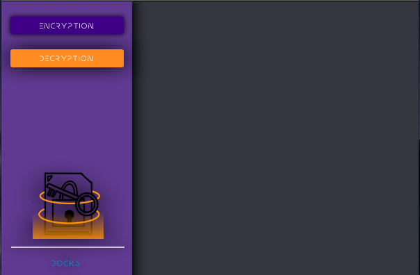

# FileFortress-AES
Software for Encrypting selected files.
-----------------------------------------

-----------------------------------------
* Introducing FileFortress AES, your ultimate encryption and decryption solution for securing your valuable files with military-grade protection.
* With a powerful 128-bit AES encryption algorithm at its core, your files are transformed into impenetrable digital fortresses, ensuring your data remains confidential and safe from prying eyes.
* 🔒 Advanced Encryption: Harness the strength of 128-bit AES encryption, a benchmark in data security. Your files are transformed into complex combinations of characters, rendering them unreadable without the decryption key.
* 🔑 Secure Key Generation: Every encrypted file comes with a unique decryption key, generated with a cryptographically robust process. This means only you, the authorized recipient, hold the power to unlock your files.
* 📦 Simplified Process: [Your App Name] keeps things simple. Encrypting and decrypting files is as intuitive as a few clicks. No technical expertise required – your data's security is now within reach for everyone.
-------------------------------------------
Why Choose FileFortress AES ?
-------------------------------------------
Security without compromise. FileFortress AES offers top-notch file protection that's effortless to use. Ideal for privacy enthusiasts and professionals alike. Take charge of your data's safety with FileFortress AES.Download now for total control over your digital secrets.
